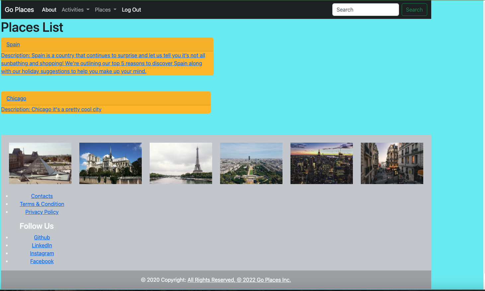

# go-places-app
[Click here to get to the Deployed Link](https://go-places-app-calin.herokuapp.com/)

## About
- An application for enthusiastic travelers, where the user can add places they want to visit. 
- The user can plan visits and activity and also mark then as completed.
- Full CRUD app where the user can add a place to visit, add photos, also can edit and delete a place.
- The user can sign in, log out and sign up. 

## Planning

[Click here to get a closer look at our Trello Planning Materials](https://trello.com/invite/b/aKi632zq/ATTIde4e8def672f6aaa9ac8e22e3fd5d4de99E68767/project-4)

### Wireframe 

#### [Click here to get a closer look at the Wireframe](https://whimsical.com/project-4-VpYrmGXDniCuYAHT12uvRD)

### ERD

#### [Click here to get a closer look at the ERD](https://whimsical.com/erd-start-M5uG3wCgLEkKZEHCeJMRB3)

### Website Preview

## Technologies Used

## Future Enhancements

- AAU i want to be able to update videos of places.
- AAU i want to be able to rate places I've been.
- AAU i want to be able to use the search bar.
- AAU i want to be able to add and delete activities
- AAU i want to asign each activity to each place that i want to visit.

